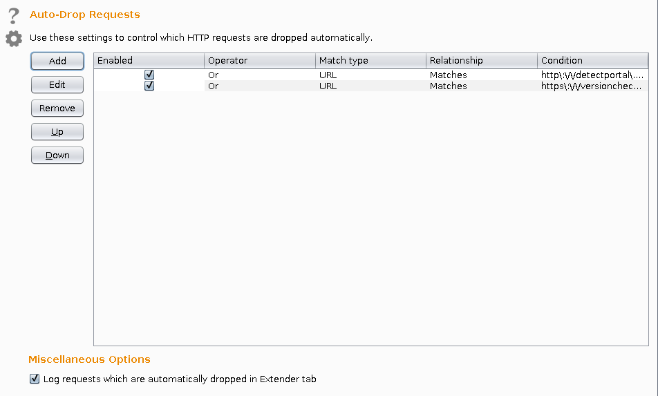
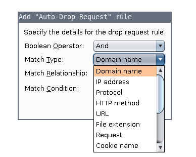
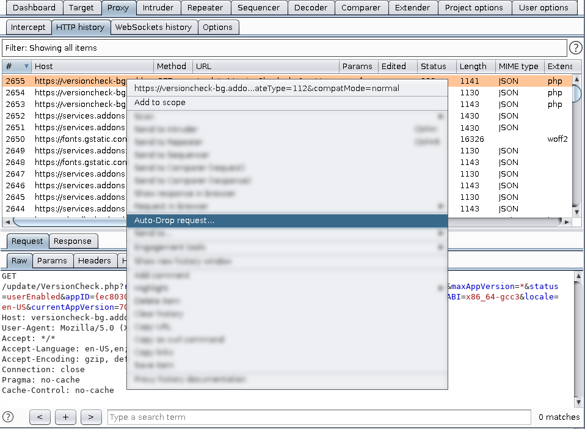

# Burp-Auto-Drop-Extension

This extension allows you to automatically drop requests that match certain conditions. 
This might be helpful in case the target has logging or tracking services enabled.

## Configuration

After loading the extension the "Auto-Drop"-tab contains all necessary options to manage the rules specifying which requests are going to be dropped. 

Individual rules can be activated or deactivated with the checkbox on the left of each rule. Rules can be added, edited, removed, or reordered using the buttons. 

Rules can be configured on practically any attribute of the message, including domain name, IP address, protocol, HTTP method, URL, file extension, parameters, cookies, header/body content, status code, MIME type, HTML page title, and Proxy listener port. Regular expressions can be used to define complex matching conditions for each attribute.

Rules are processed in order, and are combined using the Boolean operators AND and OR.
These are processed with a simple "left to right" logic in which the scope of each operator is as follows:

(cumulative result of all prior rules) AND/OR (result of current rule)

All active rules are processed on every message, and the result  determines whether the message is dropped.

## Context-Menu

New rules can also be added by using the context menu in the Proxy history. 

## Save and load options

Usually the options of the "Auto-Drop"-tab are saved automatically. However, if you switch computers you may save and load your current options. This can be done by clicking on the gear-symbol in the upper-left corner of the "Auto-Drop"-tab and select the appropriate context-menu-entry.

## Miscellaneous Options

To debug your ruleset you can enable the "Log requests which are automatically dropped in the Extender-tab". 

## Build

This project was built using IntelliJ and Gradle. When you make changes to the source (and especially the GUI) you should apply following settings within Intellij to make sure that everything builds successfully:
* File -> Settings -> Editor -> GUI Designer -> Generate GUI into: Java source
* File -> Settings -> Build, Execution, Deployment -> Compiler -> Build project automatically

When the GUI is not updated correctly you may rebuild the project manually:
* Build -> Rebuild Project

After that you can execute the "fatJar"-task within the "build.gradle"-file. This will produce a jar in the "build/libs/" directory called "burp-send-to-extension-{version}.jar".
